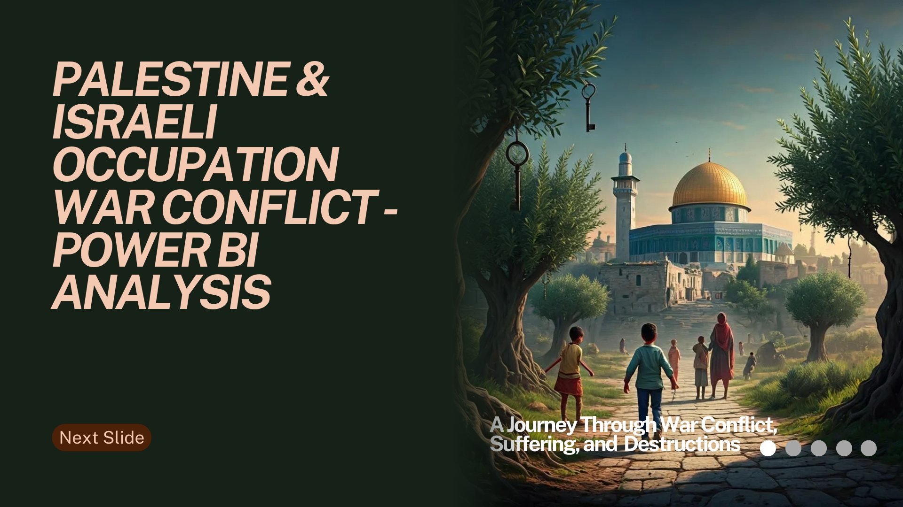

# DEPI-Final-Project

## Project Title

### Palestinian & Israeli conflict Analysis

## Project Objectives

- Analyze and visualize fatalities in the Israeli-Palestinian conflict (2000–2023) and recent events in Palestine (October 2023–October 2024).
- Provide comparative insights between the Irish conflict (1969–2005) and the Palestinian conflict to identify patterns of resistance, violence, and civilian impact.
- Highlight regional hotspots, trends, and demographics to support the work of human rights organizations, journalists, and policymakers.
- Develop interactive dashboards to enable dynamic data exploration and storytelling.

## Phases of Analysis
### 1. Data Gathering

Data Sources Used:

- Palestine Conflict (2000–2023):
[UN OCHA](https://www.ochaopt.org/data/casualties)
[B'Tselem](https://statistics.btselem.org/en/all-fatalities/by-date-of-incident?tab=overview)

- Palestine Casualties (7 Oct 2023 – 6 Oct 2024):
[Tech for Palestine](https://data.techforpalestine.org/docs/datasets/)
[Al Jazeera](https://www.aljazeera.com/news/longform/2024/10/8/one-year-of-israels-war-on-gaza-by-the-numbers)

- Irish Conflict (1969–2005):
[CAIN Web Service, Laurence McKeown](https://cain.ulster.ac.uk/sutton/tables/index.html)

### 2. Data Cleaning and Transformation

Palestine Datasets:
- Standardized data formats for consistent time-series analysis.
- Merged multiple datasets (UN OCHA and B’Tselem) to avoid redundancy.
- Consolidated columns like "casualty type," "region," and "age group" for easier comparison.

Irish Dataset:
- Categorized fatalities into civilians and combatants.
- Extracted demographic details (gender, age) for pattern analysis.
- Cleaned inconsistent location names for geographic analysis.

### 3. Data Integration

- Created a unified schema to compare datasets, ensuring fields like:
- Date of Incident
- Region
- Type (Civilian/Combatant)
- Cause of Fatality (Gunfire, Explosion)
- Age and Gender

### 4. Data Analysis

Built KPIs to uncover:
- Yearly trends, civilian vs. combatant fatalities, gender-based patterns, and regional hotspots.
- Comparative insights (e.g., spikes during escalations in Palestine and Ireland).

### 5. Visualization and Dashboard Development

Designed four dashboards in Power BI:
- Overview, Demographics, Geography, and Cause & Effect for the Palestinian data.
- A Comparative Dashboard for the Irish and Palestinian conflicts.
- Added filters for interactivity (e.g., region, year, fatality type).

### 6. Reporting and Insights
- Created a final presentation using Canva and PowerPoint to highlight findings.

## Key Insights or Findings

1. Palestinian-Israeli Conflict (2000–2023):
- 10,631 Palestinian fatalities and 1,332 Israeli fatalities, with males accounting for 87% of total deaths.
- 25% of Palestinian fatalities were children (≤18 years old), emphasizing the severe impact on youth.
- Gunfire and live ammunition caused the majority of deaths (10,554 cases).
- Spikes in fatalities were observed during events like the Second Intifada (2002) and Gaza conflicts (2014, 2021).
- Geographically, Gaza Strip accounted for 74.8% of Palestinian fatalities, making it the most affected region.

2. Recent Palestine Events (2023–2024):
- The dashboard tracks daily updates from October 7, 2023, to October 6, 2024.
- Highlights regional violence escalation in real-time, crucial for humanitarian and media responses.

3. Irish Conflict (1969–2005):
- Showed similar patterns of civilian and combatant fatalities, with escalation during key political events (e.g., Bloody Sunday, 1972).
- A high percentage of civilian casualties during military confrontations mirrors the patterns seen in Palestine.

## Comparative Insights:

- Both conflicts reveal the prolonged impact on civilians, with fatalities accumulating over decades.
- Spikes in violence in both cases are linked to political escalations and military operations.
- Regional hotspots like Derry in Ireland and the Gaza Strip in Palestine demonstrate concentrated violence over time.

## Key Questions Explored
- How did fatality trends change over time in the Palestinian and Irish conflicts?
- What percentage of fatalities were civilians vs. combatants, and how did this shift across conflict phases?
- Which demographics (age, gender) were most affected in both conflicts?
- How did specific regions (e.g., Gaza, Derry) bear the brunt of violence?
- Can patterns from the Irish conflict provide insights into the Palestinian resistance?

## Challenges or Limitations
- Incomplete data for certain years: The Irish conflict data lacked granularity for minor events and specific demographic details, affecting direct comparisons.
- Recent conflict updates: Real-time data (2023–2024) can evolve rapidly, necessitating continuous updates for relevance.
- Regional context: The sociopolitical dynamics in Ireland and Palestine differ, making direct parallels challenging without qualitative context.
- Visualization complexity: Balancing simplicity and detail in the dashboards to ensure accessibility while maintaining insight depth.

## Technical Overview

### Tools Used:
- Power BI Desktop & Online: For building and publishing interactive dashboards.
- Excel: For raw data cleaning, preparation, and transformation.
- Prompt Engineering: For structuring design elements and effective visual storytelling.
- Canva: To enhance visual elements for presentations.
- PowerPoint: For summarizing findings into compelling reports.

## Measures and Calculations
- Year-over-Year Fatality Trends:
Measure: Total fatalities by year.
Calculation: Count of fatalities grouped by date_of_event.

- Civilian vs. Combatant Fatalities (%):
Measure: Proportion of civilian deaths.

- Age Analysis (Average, Min, Max).

- Cumulative Fatalities:
Measure: Running total of fatalities over time.

- Regional Analysis:
Fatalities by event_location_region using heatmaps in Power BI.

## Dashboard Structure
1. Palestinian-Israeli Conflict Dashboard:
- Key sections: Overview, demographics, regions, and causes.
2. Irish Conflict Dashboard:
- Visual comparisons of civilian vs. combatant fatalities, gender breakdown, and trends over time.
